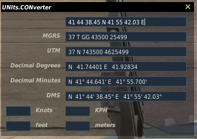
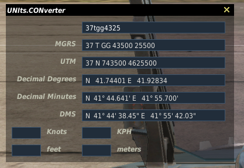
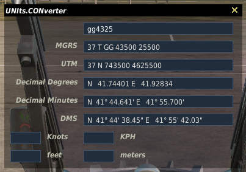

DCS UNIts.CONverter
===================

In-Game, In-Flight DCS UI to convert coordinates across different conventions.

Scratchpad extension (scratchpad >= 0.7.0)
-----------------------------------------

### Installation

* Download `dcs-unicorn-scratchpad-v*.zip` from [latest release](./releases/latest)
* Extract the zip to `%HOMEPATH%\Saved Games\DCS.openbeta` (or `%HOMEPATH%\Saved Games\DCS` for stable)

### Usage
* Open scratchpad.
* Enter coordinates.
* Hit COORDS, and see it get translated in various formats.

Standalone UI
-------------

### Installation

* Download `dcs-unicorn-standalone-v*.zip` from [latest release](./releases/latest)
* Extract the zip to `%HOMEPATH%\Saved Games\DCS.openbeta` (or `%HOMEPATH%\Saved Games\DCS` for stable)
From DMS (Decimal Minutes Seconds)

From (partial) MGRS

### Usage

Once in a mission, in an aircraft, hit `Ctrl+Shift+Z`.
Enter coordinates in the topmost field.

Imperial/Metrics conversions work both ways.

### Configuration

Edit `%HOMEPATH%\Saved Games\DCS.openbeta\Config\unicon.lua` to change the hotkey.
